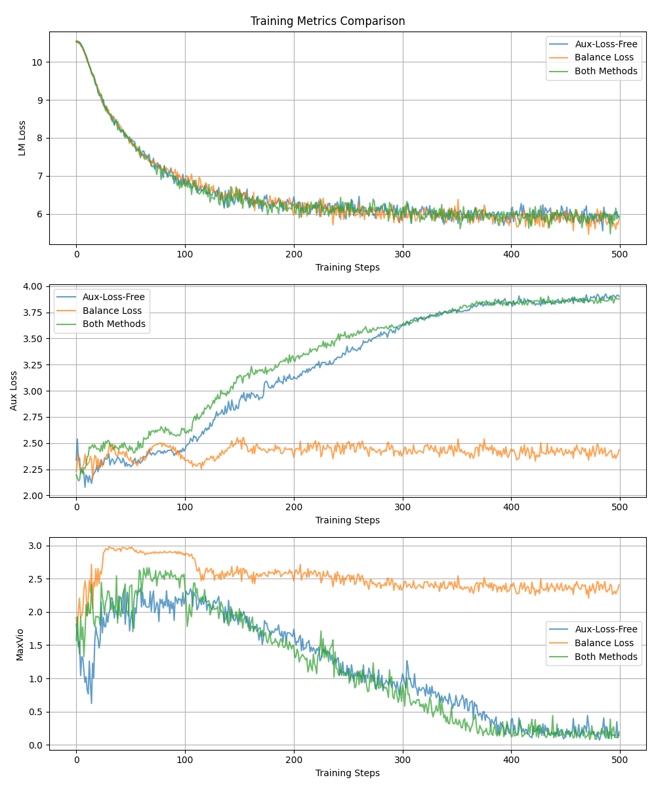

# ⚖️ Auxiliary-Loss-Free Load Balancing for Mixtral-8x7B

An unofficial implementation of [Auxiliary-Loss-Free Load Balancing Strategy for Mixture-of-Experts](http://arxiv.org/abs/2408.15664).

This implementation is based on [Mixtral-8x7B-Instruct-v0.1](https://huggingface.co/mistralai/Mixtral-8x7B-Instruct-v0.1) model code, which is relatively clean and easy to understand.

You can check the `NOTE(tzhu)` comments in `src/modeling/modeling_mixtral.py` for more details.

## 🌴 Dependencies

- Python==3.11.9
  - torch==2.4.1
  - transformers==4.45.1
  - datasets==3.0.1

## 🚀 Quick Start

```bash
# Change GPU settings in `scripts/run.sh`
# Change model settings in `src/modeling/configuration_mixtral.py`
# The default model size is very small and consumes about 8504 MB GPU memory.

# AND FIRE!!
bash scripts/run.sh
```

## 📊 Results



## 📚 Citation

If you find this work useful, please cite the following paper and our repository:

```bibtex
@article{wang2024auxiliary,
  title={Auxiliary-loss-free load balancing strategy for mixture-of-experts},
  author={Wang, Lean and Gao, Huazuo and Zhao, Chenggang and Sun, Xu and Dai, Damai},
  journal={arXiv preprint arXiv:2408.15664},
  year={2024}
}

@software{zhu2025auxfree,
  author = {Zhu, Tong},
  month = {5},
  title = {{Auxiliary-Loss-Free Load Balancing for Mixtral-8x7B}},
  url = {https://github.com/Spico197/aux-free},
  version = {0.1.0},
  year = {2025}
}
```